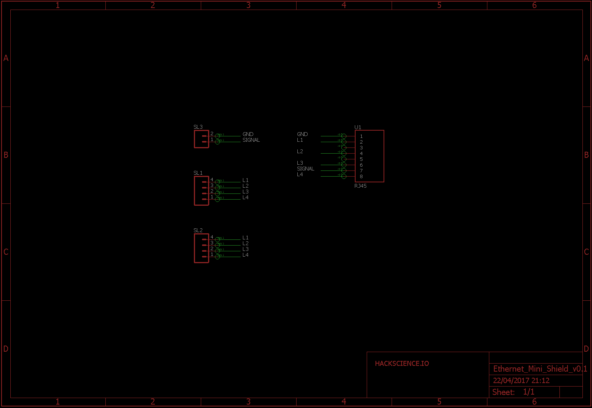
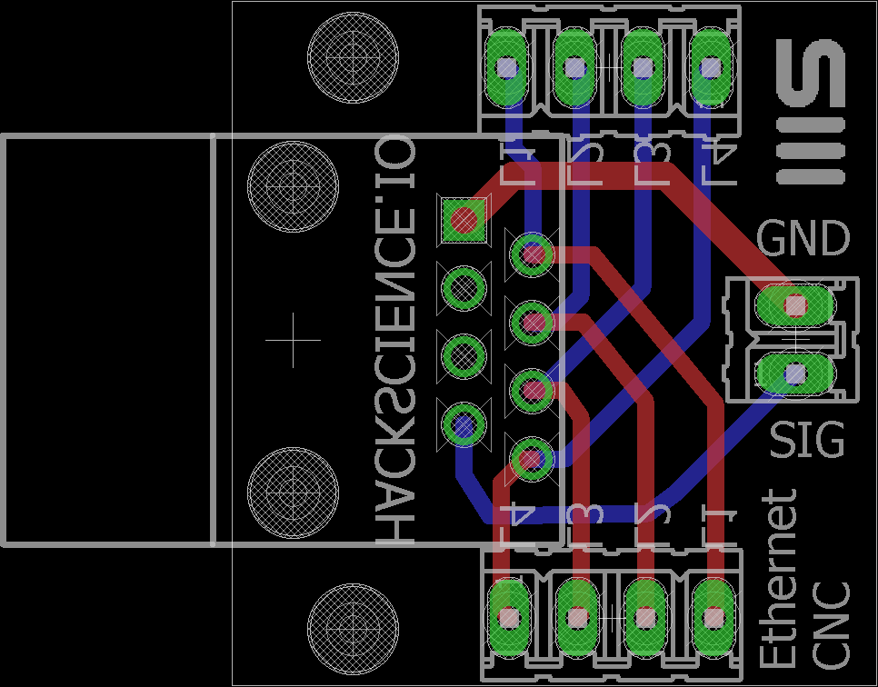

# EthernetMiniShield

Ethernet connector for the Arduino CNC Shield.

## Schematic

## Board

## BOM

For boards placed on CNC shield:

1. [RJ45 8-Pin Connector] x1 http://bit.ly/2og5aNq 
2. [2.45mm female pin header](http://ebay.eu/2oAhZgO) - 4 pins x2 rows
3. Molex KK 0.1" PCB header 2-way x1
4. Molex KK 0.1" PCB housing 2-way x1
5. Molex KK 0.1" PCB contacts x2
6. Wires (GND, signal) TBD
7. Housing TBD
8. Contacts TBD

For boards placed on pump:

1. [RJ45 8-Pin Connector] x1 http://bit.ly/2og5aNq 
2. Molex KK 0.1" PCB header 4-way x1 (Stepper)
3. Molex KK 0.1" PCB header 2-way x1
4. Molex KK 0.1" PCB housing 2-way x1
5. Molex KK 0.1" PCB contacts x2
6. Wires (GND, signal) TBD
7. Housing TBD
8. Contacts TBD

## Supplier

PCBWay.com - compress and upload all files in eagle directory except .sch, .brd and cam sub-directory.